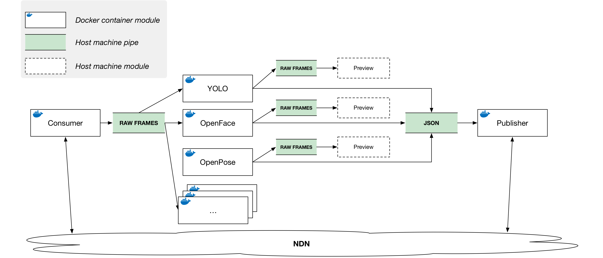

# ICE AR Repository

Current prototype architecture draft:

[prototype architecture draft 07/25](doc/proto-draft-0725.pdf)

## Mobile Terminal

*TBD*

## Edge Node

### DOCKER

> **NOTE:** In order to benefit from GPU acceleration, one must install [nvidia-runtime](https://github.com/NVIDIA/nvidia-docker) runtime on their host machines. Edge node processing modules are relying on this runtime and, most likely, won't run if it's not installed.

#### QUICK START HOW-TO

> **This section is intended for quick start ready-to-go edge node bootstrapping. For detailed information one shall read sections below.**

<details>
    <summary><i>#0 <b>Prepare host machine</b></i></summary>
     
   Creating folders for previews, logs, temporary files to analyze during edge node runtime.
</details>

```Shell
mkdir edge && cd edge
mkdir preview logs faces
```

<details>
    <summary><i>#0.5 <b>Copy OpenFace training data to "faces" subfolder</b></i></summary>
     
   > It is needed to train OpenFace. More info [below](#openface-processing)!
</details>

```Shell
cp -a <OpenFace train data folder>/. faces/
```

<details>
    <summary><i>#1 <b>Launch publishing module</b></i></summary>
     
   > **It is assumed that NFD is up and running on host machine and routes are configured properly**
</details>

```Shell
docker run --name publisher -v /var/run:/var/run -v $HOME/.ndn:/root/.ndn -v annotationsVol:/in -d peetonn/ice-ar:publisher
```

<details>
    <summary><i>#2 <b>Launch processing modules</b></i></summary>
    
   Nothing's here 👹
</details>

```Shell
docker run --runtime=nvidia --name=yolo1 -v rawvideoVol:/in -v annotationsVol:/out -v `pwd`/preview:/preview -d peetonn/ice-ar:yolo
docker run --runtime=nvidia --name=openpose1 -v rawvideoVol:/in -v annotationsVol:/out -v `pwd`/preview:/preview -d peetonn/ice-ar:openpose
docker run --runtime=nvidia --name=openface-trained -v `pwd`/faces:/faces peetonn/ice-ar:openface /train.sh /faces
docker commit openface-trained ice-ar:openface-trained
docker run --runtime=nvidia --name=openface1 -v rawvideoVol:/in -v annotationsVol:/out -v `pwd`/preview:/preview -d ice-ar:openface-trained /run.sh
```

<details>
    <summary><i>#3 <b>Launch consumer module</b></i></summary>
     
   **It is assumed that NFD is up and running on host machine and routes are configured properly**
</details>

```Shell
docker run --name=consumer1 -v /var/run:/var/run -v $HOME/.ndn:/root/.ndn \
    -v rawvideoVol:/out -v `pwd`/logs:/tmp -v `pwd`/preview:/preview \
    peetonn/ice-ar:consumer
```

> **What now?**
>
> Your edge node setup should be running.
> ```
> $ docker ps --format '{{.Names}}'
> consumer1
> openface1
> openpose1
> yolo1
> publisher
> ```
> `logs` folder will contain consumer's log files, so you may want to read/analyze those if something is going wrong or not as expected (advice: use `tail -f` for log files and don't panic).
>
> In `preview` folder you should be able to see preview file pipes for each module: `mt-out` (for consumer module), `yolo-out`, `openface-out` and `openpose-out`. To render these previews using GUI, use `ffplay`:
> ```
> ffplay -f rawvideo -vcodec rawvideo -s 320x180 -pix_fmt argb -i preview/mt-out
> ffplay -f rawvideo -vcodec rawvideo -s 320x180 -pix_fmt bgra -i preview/yolo-out
> ffplay -f rawvideo -vcodec rawvideo -s 320x180 -pix_fmt bgr24 -i preview/openface-out
> ffplay -f rawvideo -vcodec rawvideo -s 320x180 -pix_fmt bgr24 -i preview/openpose-out
> ```
> If you don't see some previews - don't worry, they will appear as soon as processing module will start receiving and processing first frame. This means, by the way, that if you don't see `mt-out` there, most likely your consumer module isn't receiving any video - time to check your NFD routes!


#### DETAILED DESCRIPTION

In order to provide easy and quick edge-node deployment, edge node modules were containerized. These modules can (and should) interact with each other in order to provide full edge node functionality.
There are three types of edge node modules:

- **Fetching module**

    Fetching modules implement *input functionality* of an edge node. I.e. fetching module communicates with the outside world (for example, over the network, NDN) and retrieves data from clients who are interested in providing their data for edge node processing. Fetching modules usually provide some kind of data channel (for example, file pipe) for other modules to consume. Thus,  one shall create [volumes](https://docs.docker.com/engine/admin/volumes/volumes/) that can be shared between fetching modules and other modules. Data channels created by fetching modules generally must allow **1-to-Many** data dissemination in order to allow plug-n-play scalability for processing modules. An example fetching module would be a video consumer, that fetches video from a client, decodes it and writes decoded frames into a data channel for processing modules to consume. 
- **Processing module**

    Processing modules implement *business logic* functionality of an edge node. These modules have inputs and outputs: they consume data received by fetching module(s), use/process it according to their logic and output results into some data channel for other modules to use. For example, an example processing module would be a module that detects cats on ARGB images and writes bounding boxes for detected cats to some data channel (file pipe, for example). It is useful, in general, if output data channels support **Many-to-Many** (or at least **Many-to-1**) model, so that other modules are able to use processed data.
- **Publishing module**

    Publishing modules consume data from other (processing) modules and make it available for clients. Publishing modules usually have one input data channel (file pipe) which supports **Many-to-1** synchronization model (in order to allow multiple processing modules to write to it), and have no output data channels, as they provide data for clients by other means (network).

Currently, the following modules are implemented:

- **Mobile Terminal Video fetching module** // Dockerhub: [peetonn/ice-ar:consumer](https://hub.docker.com/r/peetonn/ice-ar/tags/)

    *This module fetches video (over NDN) from a *Mobile Terminal* (mobile video producer), decodes and writes it frame by frame (ARGB format) into a unix socket (powered by [nanomsg](http://nanomsg.org/)).*
- **YOLO processing module**  // Dockerhub: [peetonn/ice-ar:yolo](https://hub.docker.com/r/peetonn/ice-ar/tags/)

    *This module consumes raw video frame by frame from a unix socket and processes it by GPU-accelerated object recognition software [YOLO](https://pjreddie.com/darknet/yolo/). Resulting information is formatted as JSON dictionary and written into another unix socket.* 
- **OpenFace processing module** // Dockerhub: [peetonn/ice-ar:openface](https://hub.docker.com/r/peetonn/ice-ar/tags/)

    *This module consumes raw video frame by frame from a unix socket and processes it by GPU-accelerated face recognition software [OpenFace](https://cmusatyalab.github.io/openface/). Resulting information is formatted as JSON dictionary and written into another unix socket.*
- **OpenPose processing module** // Dockerhub: [peetonn/ice-ar:openpose](https://hub.docker.com/r/peetonn/ice-ar/tags/)

    *This module consumes raw video frame by frame from a unix socket and processes it by GPU-accelerated pose recognition software [OpenPose](https://github.com/CMU-Perceptual-Computing-Lab/openpose). Resulting information is formatted as JSON dictionary and written into another unix socket.* 
- **Annotations publishing module** // Dockerhub: [peetonn/ice-ar:publisher](https://hub.docker.com/r/peetonn/ice-ar/tags/)

   This module consumer JSON arrays from a unix socket and makes this information available over the network (NDN) for clients.

The diagram below shows how these modules interoperate:



#### Mobile Terminal Video fetching

>
><details>
>    <summary><b>Optional:</b><i>Building container manually (expand for more info)</i></summary>
>    
>     cd edge/ndnrtc/docker
>     docker build -t ice-ar:consumer .
>
>   See [Dockerfile](edge/ndnrtc/docker/Dockerfile) for additional info.
>    
></details>

For video fetching, a modified [ndnrtc-client](https://github.com/remap/ndnrtc/tree/master/cpp/client) application is used. For more detailed information on how ndnrtc-client and NDN-RTC library operate, one shall refer to the official [repo](https://github.com/remap/ndnrtc/).

One must install and configure NFD on their host machine as this container relise on it. 
To run video fetching consumer with default arguments:

```
docker run --name=consumer1 \
    -v /var/run:/var/run -v $HOME/.ndn:/root/.ndn -v /tmp:/tmp -ti \
    peetonn/ice-ar:consumer
```

There are few environment variables exposed for custom configuration:

- `RUNTIME` -- runtime for consumer (default `10000` seconds);
- `SIGNING_IDENTITY` -- signing identity (default is `/`; not actually used, needed for app ot run);
- `CONSUMER_CONFIG` -- ndnrtc-client configuration file - this one describes prefixes and streams to fetch (default is `/icear-consumer.cfg`, provded with the container);
- `POLICY_FILE` -- verification policy file (default is `/rule.conf`, provided with the container).

#### Yolo processing

>
><details>
>    <summary><b>Optional:</b><i>Building container manually (expand for more info)</i></summary>
>    
>     cd edge/darknet/docker
>     docker build -t ice-ar:yolo .
>
>   See [Dockerfile](edge/darknet/docker/Dockerfile) for additional info.
>    
></details>


To run YOLO container, one must install Docker [nvidia-runtime](https://github.com/NVIDIA/nvidia-docker) on their machine, in order to benefit from GPU acceleration.
As was explained earlier, container takes raw video as an input and outputs annotations as JSON arrays. It also provides output as raw video with bounding boxes rendered, for preview purposes. All these inputs and outputs can be configured and have default values (can be found in YOLO [Dockerfile](edge/darknet/docker/Dockerfile#L15)). Here is the description of each variable:

- `INPUT` -- file/unix socket to read raw video from;
- `FRAME_WIDTH` -- video frame width;
- `FRAME_HEIGHT` -- video frame height;
- `OUTPUT` -- file/unix socket to write JSON annotations to;
- `PREVIEW` -- file/unix socket to write preview video (with rendered annotations boxes) to.

The following command can be used to start YOLO container (it is assumed, however, that incoming video is written to a file in `/tmp` folder on host machine; frame size is default as defined by Dockerfile and annotations output and preview files must be written to `/tmp` folder on host machine):

```
 docker run --runtime=nvidia --name=yolo1 -a stdout \
    -v /tmp:/in -v /tmp:/out -v /tmp:/preview \
    peetonn/ice-ar:yolo
```

#### OpenFace processing

>
><details>
>    <summary><b>Optional:</b><i>Building container manually (expand for more info)</i></summary>
>    
>     cd edge/openface/docker
>     docker build -t ice-ar:openface .
>
>   See [Dockerfile](edge/openface/docker/Dockerfile) for additional info.
>    
></details>

First, one needs to train OpenFace on face images. One should prepare a folder with subfolders, each named after person's id (or a name, whitespaces allowed) and containing `.jpg` training images. There are no specific requirements in terms of resolutions and sizes of images (faces will be detected automatically and aligned into 96x96 square images prior training). Here's an example of how training folder should look like:

- **faces**
  - *alex o'harra*
    - *image1.jpg*
    - ...
  - *bob smith*
    - *image1.jpg*
    - ...
  - *connor mckinsey*
    - *image1.jpg*
    - ...
  - *...*
  
To start training, one shall mount **faces** folder into a container and run training script:

```
docker run --runtime=nvidia --name=openface-trained \
    -v $(pwd)/faces:/faces \
    peetonn/ice-ar:openface /train.sh /faces
```

Once training is complete, commit container as an image and start using it:

```
docker commit openface-trained ice-ar:openface-trained
docker run --runtime=nvidia --name=openface1 \
    -v /tmp:/in -v /tmp:/out -v /tmp:/preview \
    ice-ar:openface-trained /run.sh
```

Like with [YOLO](#Yolo-processing) container, there is a number of [environment variables](edge/openface/docker/Dockerfile#L21) available to customize `run.sh` script:

- `INPUT` -- file/unix socket to read raw video from;
- `FRAME_WIDTH` -- video frame width;
- `FRAME_HEIGHT` -- video frame height;
- `OUTPUT` -- file/unix socket to write JSON annotations to;
- `PREVIEW` -- file/unix socket to write preview video (with rendered annotations boxes) to.
- `TORCH_MODEL` -- [Torch](http://pytorch.org/) model to be used by OpenFace ([more info](https://cmusatyalab.github.io/openface/models-and-accuracies/));
- `DLIB_MODEL` -- [Dlib](http://dlib.net/) model to be used by OpenFace ([more info](https://cmusatyalab.github.io/openface/models-and-accuracies/));
- `LABELS` -- labels file, file generated during training phase which contains labels for different face classes;
- `REPS` -- reps file, file generated during training phase which contains faces features; 
- `TRAIN_FOLDER` -- folder, which contains faces images for training (default is `/faces`).

#### OpenPose processing

>
><details>
>    <summary><b>Optional:</b><i>Building container manually (expand for more info)</i></summary>
>    
>     cd edge/openpose/docker
>     docker build -t ice-ar:openpose .
>
>   See [Dockerfile](edge/openpose/docker/Dockerfile) for additional info.
>    
></details>

To run this module with default parameters:

```
docker run --runtime=nvidia --name=openpose1 \
    -v /tmp:/in -v /tmp:/out -v /tmp:/preview \
    peetonn/ice-ar:openpose
```

Like other containers, this container has few configurable arguments:

- `INPUT` -- file/unix socket to read raw video from;
- `FRAME_WIDTH` -- video frame width;
- `FRAME_HEIGHT` -- video frame height;
- `OUTPUT` -- file/unix socket to write JSON annotations to;
- `PREVIEW` -- file/unix socket to write preview video (with rendered annotations boxes) to.


#### Annotations publishing

>
><details>
>    <summary><b>Optional:</b><i>Building container manually (expand for more info)</i></summary>
>    
>     cd edge/publisher/docker
>     docker build -t ice-ar:publisher .
>
>   See [Dockerfile](edge/publisher/docker/Dockerfile) for additional info.
>    
></details>

One must ensure, that NFD is installed and running on host machine in order to have publisher working properly.
To run annotations publisher module with default configuration:

```
docker run --name publisher \
    -v /var/run:/var/run -v $HOME/.ndn:/root/.ndn -v /tmp:/in \
    peetonn/ice-ar:publisher
```

This module publishes annotations as [Generalized NDN objects](doc/generalized-object.pdf) under configurable prefix (which, generally speaking, can be arbitrary, but should be known by a client in order to fetch annotations):

    <base prefix>/<user-id>/<service>/<frame-number>/<engine-name>/<generalized-object:annotaion>
    ^               ^            ^           ^                ^               ^        
    |               |            |           |                |               + -- generalized object sub-namespace
    |               |            |           |                + -- processing engine name, e.g. "yolo", "openface", "openpose", etc.
    |               |            |           + -- video frame number, as provided by mobile client
    |               |            + -- edge node service name (can be arbitrary, currently "object_recognizer")
    |               + -- user id, should correspond to client's user id
    + -- base prefix, default is `/icear/user`

One may alter default configuration by passing environment variables into container:

- `INPUT` -- input file pipe/unix socket for JSON annotations (default is `/in/ice-annotations`);
- `BASE_PREFIX` -- base prefix (default is `/icear/user`);
- `USER_ID` -- user id (default is `peter`);
- `SERVICE` -- edge node service name (default is `object_recognizer`).


## Content Provider

*TBD*
